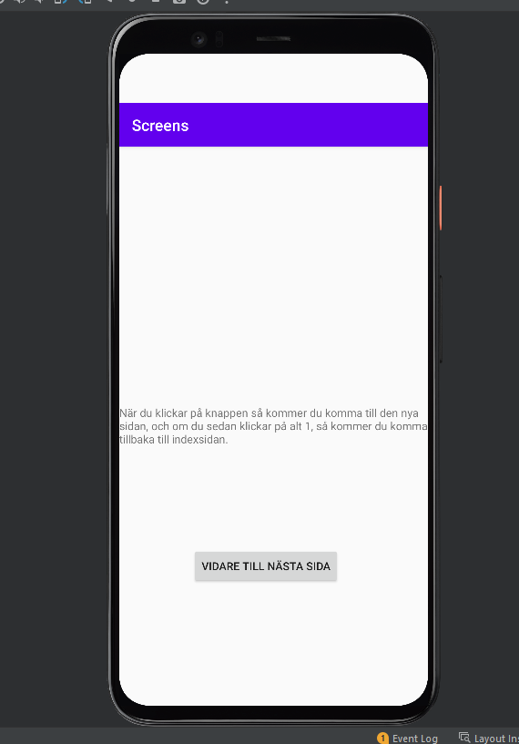
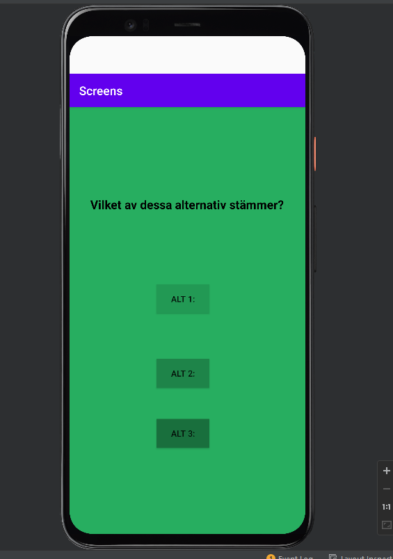

# Rapport
**Skriv din rapport här!**

För att göra denna uppgift så lades en till activity, genom att lägga till en "empty actitvty" sedan
genom en knapp så skickas användaren till den nya sidan. Nedan visas ett kod exempel:
button.setOnClickListener(new View.OnClickListener() {
//@Override
public void onClick(View view){
startActivity(new Intent(MainActivity.this, SecondActivity.class));
}
});
Här nedan så visas två bilder på den olika sidorna.

